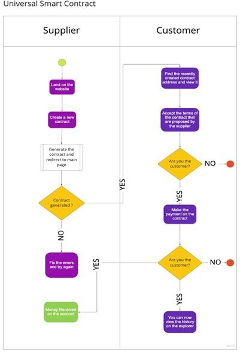

# Product features

The main flow of this prototype is designed simply on a flowchart.

#### TxType

this data will include critical information (e.g. applicable law) which cannot be numerically or Boolean-format parametrized.

unique name of the supplier of goods or services\*\*.\*\*

unique identification number issued by the Trade Registry\*\*.\*\*

unique identification number (VAT) with the Fiscal Authorities\*\*.\*\*

This is the unique bank account number of EA; payment is done by the EB bank account into this bank account\*\*.\*\*

unique name of the supplier of goods or services\*\*.\*\*

