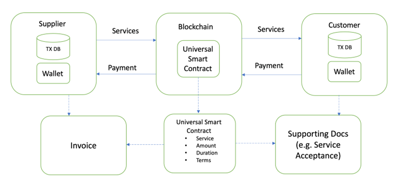

# Introduction

In an economic sense a transaction means the delivery of a services S by Entity A, and payment of the that service by Entity B, the Customer. It is worthwhile pointing out that this general description of a commercial transaction is in fact made up of a series of actions (sub-transactions) based on several data points. The fundamental difference between the traditional way of recording a commercial transaction and of recording in the newly proposed blockchain-based method is that in the traditional way, the transactions are recorded independently in each participant's database record, and from there, the information is fed into their separate financial reporting systems. In the proposed system, however, the commercial transaction details are directly written into the blockchain, with participants now having access to details from the same source. The information is then fed into each participant’s database and reporting system. In this way, the likelihood of mismatching transaction information is diminished as the information is fed from the same source.

